In this lab we will create a data workflow that will continuously pull
news stories from the web, transform them on the fly into a useable
format, and then analyze their topics using the Microsoft Cognitive
Services available through the data lake analytics service. At the end
we will visualize these story topics in Power BI.

We will use a storage account, logic apps, stream analytics, data lake
analytics (U-SQL) and finally Power BI. At the end, all these services
can be deleted.

Our first step is to create somewhere to store the data….

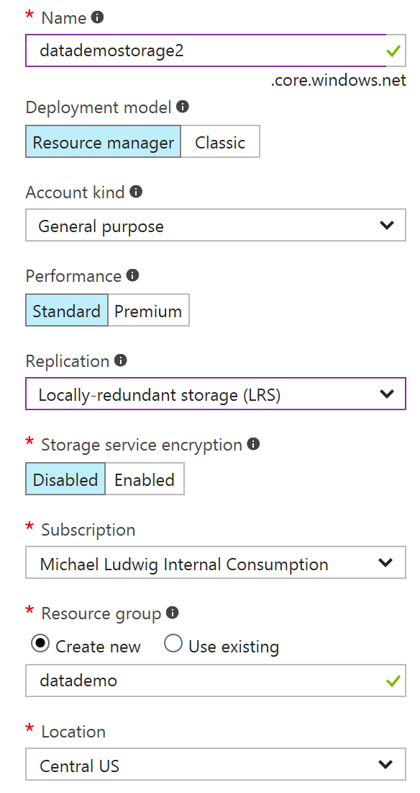

Create a storage account
========================

1.  In the Portal search for “storage accounts” (not “classic”)

2.  Click “add” to create a new storage account

3.  Give it a globally unique name

4.  Leave the Deployment model as “Resource manager”, the Account kind
    as “General purpose” and the Performance as “Standard”.

5.  Select “Locally-redundant” storage (cheaper)

6.  And create a new resource group called “datademo” in which we will
    put all the items we create in this workshop.

7.  Pick a location near you.

8.  Click “Create”.

Create the Logic App
====================

In the following section we will create a logic app with three sections.
It will trigger every 10 minutes, call an RSS endpoint from Google News
and write that file to blob storage.

When completed it will look like this:

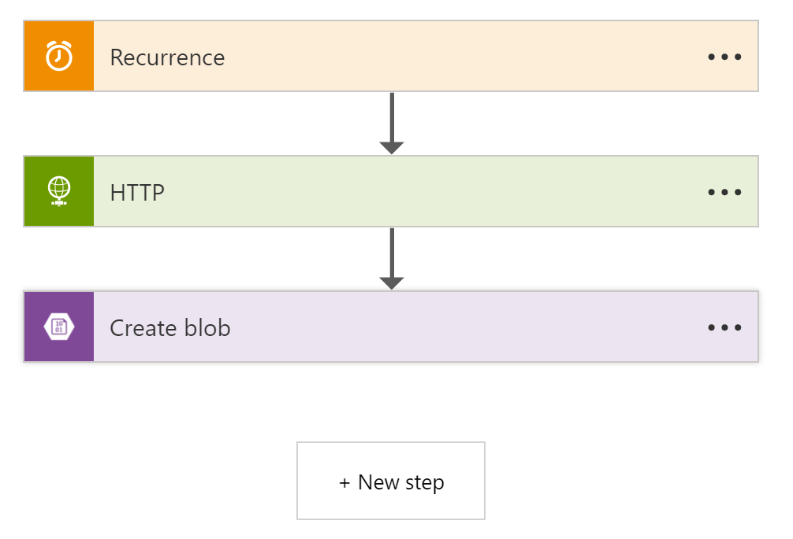

Create the logic app
--------------------

1.  In the portal search for “Logic Apps”

2.  Click “Add”

3.  Fill in the required fields

4.  If you have not already created a resource group, select “Create
    New” and give it a name of “datademo”

5.  Pick a location near you

6.  Click
    “Create”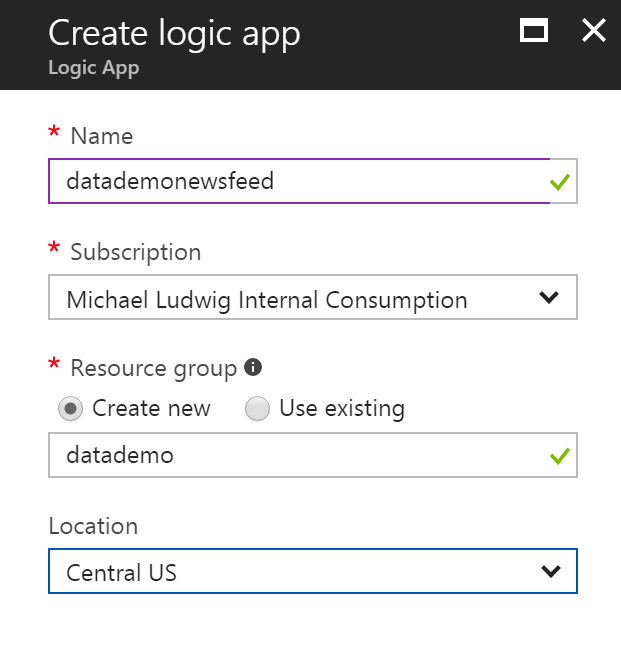

    1.  Set the Recurrence
        ------------------

<!-- -->

1.  In the screen that pops up, select the “Recurrence” step

2.  Set the Frequency to “Minute” and the Interval to 10:

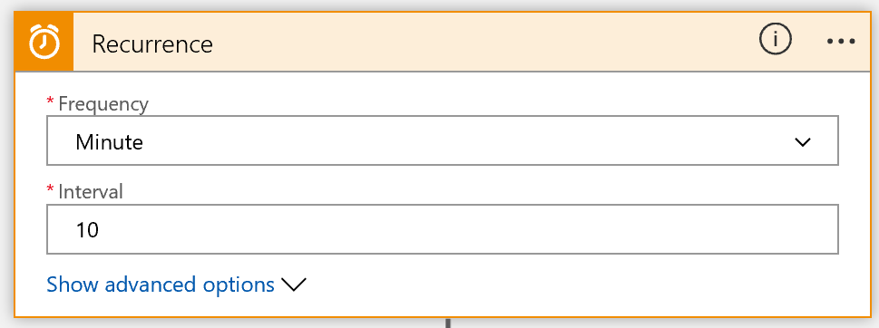

Set the HTTP GET method
-----------------------

1.  Click “New Step” and then “Add Action”

2.  In the “Choose Action” box that appears, select the HTTP Service,
    andthen the “HTTP – HTTP” action.

3.  Under “Method” select GET

4.  In the URI paste the following RSS feed location:  
    <https://news.google.com/news?pz=1&cf=all&ned=us&hl=en&q=microsoft&tbs=qdr:h&output=rss>  
    This will retrieve an XML-formatted RSS feed from Google News for
    the keyword “microsoft”.

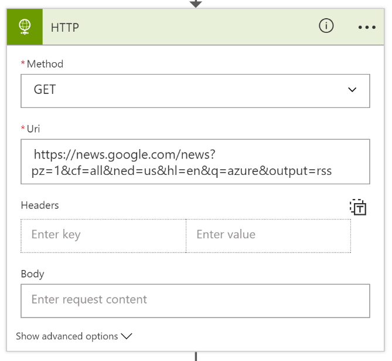

Add the Blob storage activity
-----------------------------

1.  Click on “New step” and “Add Action”

2.  In the “Choose Action” box select “Azure Blob Storage – Create Blob”

3.  Register the storage account you want to use

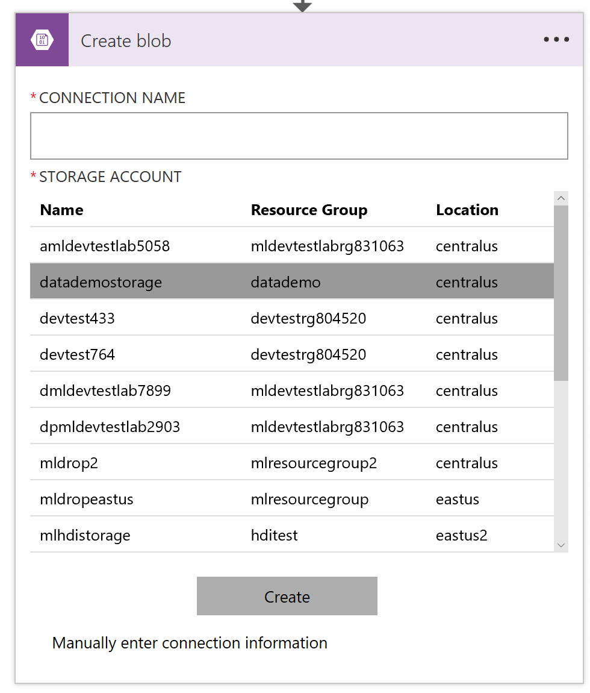

1.  Fill in the Folder path, Blob name and Blob content with the
    following values:

-   Folder path: @{concat('newsfeed/', formatDateTime(utcnow(),
    'yyyy/MM/dd'))}

-   Blob name: @formatDateTime(utcnow(), 'HH-mm')

-   Blob content: @json(Body('HTTP'))

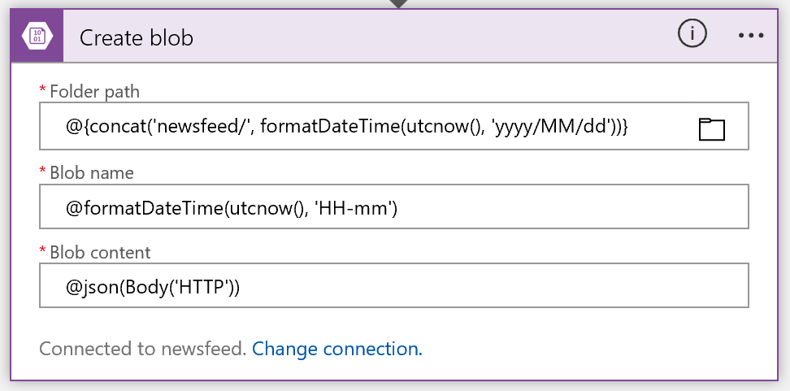

1.  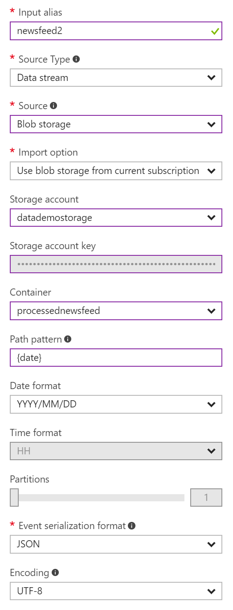Process the files with a Stream Analytics job.
    =======================================================================================================

    1.  Create a Stream Analytics Job
        -----------------------------

<!-- -->

1.  From the Portal search for Stream Analytics and click “Add”

2.  Enter a Job Name such as “ProcessNewsFeed” and select the Resource
    Group you created above

3.  Click “Create”

    1.  Create an Input
        ---------------

<!-- -->

1.  Click on “Inputs” and then “Add” in the top left of the blade.

2.  Fill in all required fields as per the image on this page.

3.  Event Serialization format should be “JSON”.

    1.  Add an Output
        -------------

<!-- -->

1.  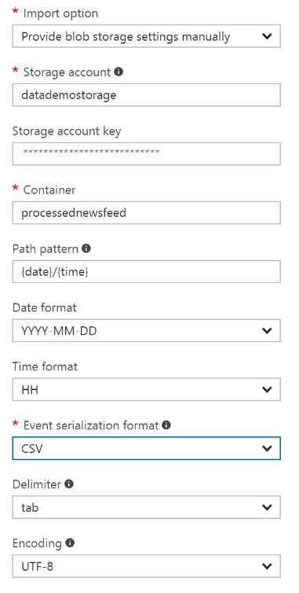Click on
    “Outputs” and then “Add” in the top left of the blade.

2.  1.  Add the Query.
        --------------

        The text of the query should be:

        SELECT

        items.ArrayValue.title, items.ArrayValue.pubDate

        INTO

        processednewsfeed

        FROM

        newsfeed nf

        CROSS APPLY GetElements(nf.rss.channel.item) as items

<!-- -->

1.  Generating Key Phrases with Data Lake Analytics 
    ================================================

    1.  Create a Data Lake Analytics Account
        ------------------------------------

<!-- -->

1.  In the portal search for “data lake analytics” and click on create.
    Fill in the required fields

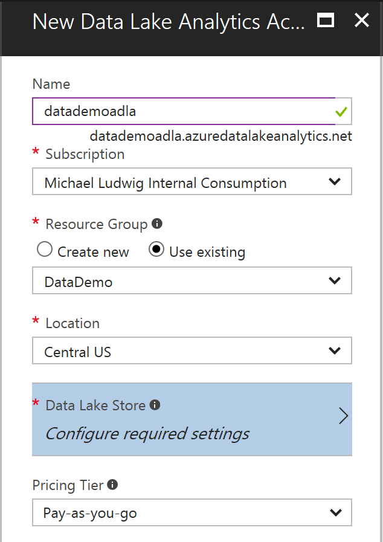

1.  Click on “Data Lake Store: Configure required settings”

2.  Select “create new data lake store”. This store will be used for
    configuration data pertaining to the data lake analytics account.

3.  Click “Create” to create the data lake analytics account

    1.  Link to the blob storage account we are using
        ---------------------------------------------

<!-- -->

1.  On the left-hand blade click “Data Sources”

2.  On the new blade that opens click “Add Data Source” at the top

3.  Fill in the blade that opens to point it to the storage account we
    created above:

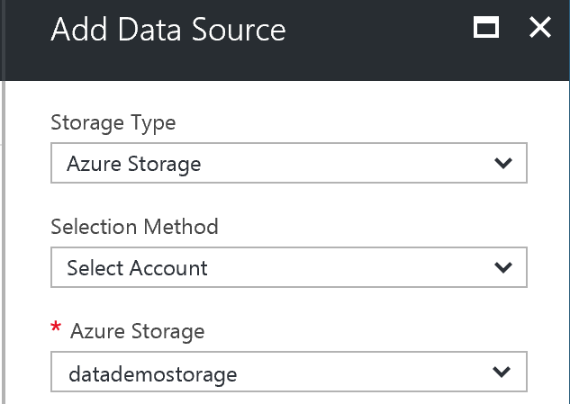

1.  Click “Add”

    1.  Load the Cognitive Service References
        -------------------------------------

The data lake does not automatically load the cognitive service
libraries that we are going to use to do text analytics, so we must load
them “manually”.

1.  At the top of the analytics blade, click “Sample Scripts”

2.  In the blade that opens, click the “Update Available…” box. This
    will kick off an ADLA job to copy the files to your
    analytics account.

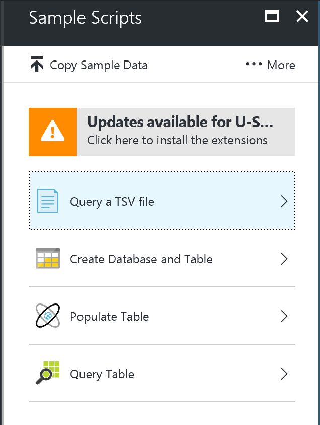

1.  You can also copy the sample data, if you want to play with it, but
    it will not be used in this workshop.

    1.  Extract Key Phrases from the news feed files with a U-SQL query
        ---------------------------------------------------------------

        1.  ### Using the Azure Portal

<!-- -->

1.  In the portal, open the Data Lake Analytics

2.  Click on “New Job” in the left-hand blade

3.  Fill in the “Job Name”

4.  Select between 5 and 30 AUs (degrees of parallelism). The more, the
    faster the job will run.

5.  Then paste or type
    the following code into the code window. (Note: it’s case
    sensitive!):

> REFERENCE ASSEMBLY \[TextCommon\];
>
> REFERENCE ASSEMBLY \[TextKeyPhrase\];
>
> @titles =
>
> EXTRACT title string,
>
> pubdate string,
>
> date string,
>
> hour string,
>
> fileName string
>
> FROM "wasb://processednewsfeed@&lt;YOUR STORAGE ACCOUNT NAME
> HERE&gt;.blob.core.windows.net/{date}{\*}/{hour}{\*}/{fileName}{\*}.csv"
>
> USING Extractors.Tsv();
>
> //the KeyPhraseExtractor requires a field named "Text", which is the
> field it will process
>
> @titlesforextractor =
>
> SELECT title AS Text
>
> FROM @titles;
>
> @keyphrases =
>
> PROCESS @titlesforextractor
>
> PRODUCE Text,
>
> KeyPhrase string
>
> READONLY Text
>
> USING new Cognition.Text.KeyPhraseExtractor();
>
> @keyphrasecounts =
>
> SELECT T.KeyPhrase,
>
> COUNT( \* ) AS KeyPhraseCount
>
> FROM @keyphrases
>
> CROSS APPLY
>
> new Cognition.Text.Splitter("KeyPhrase") AS T(KeyPhrase)
>
> GROUP BY T.KeyPhrase;
>
> OUTPUT @keyphrasecounts
>
> TO "wasb://processednewsfeed@&lt;YOUR STORAGE ACCOUNT NAME
> HERE&gt;.blob.core.windows.net/KeyPhraseCounts.csv"
>
> ORDER BY KeyPhraseCount DESC

USING Outputters.Tsv();

1.  Click “Submit Job”, sit back, and relax.

2.  When the job is done, the output file will appear in your blob
    storage at the root of the “processednewsfeed” container.

    1.  ### Using Visual Studio

        1.  #### Install the data lake tools for visual studio

<!-- -->

1.  In the Portal, go to your Data Lake Analytics

2.  On the left-hand blade select “Tools”

3.  Click on “Download Data Lake Tools for Visual Studio” (2013 or 2015)

4.  Install the Data Lake tools.

    1.  #### Create a Usql project and submit the job

<!-- -->

1.  In Visual Studio click on New-&gt;Project and select U-SQL project
    under “Azure Data Lake”:

    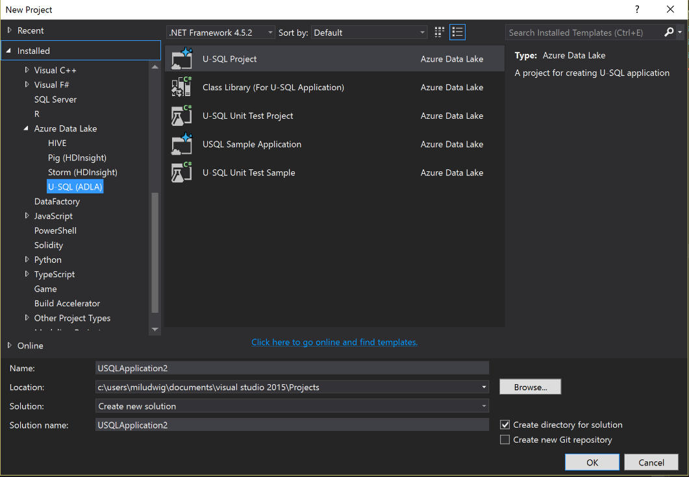

2.  Give the application a name and click “OK”

3.  In the Script.usql tab, paste the code from 4.4.1 e) above.

4.  If you are not yet logged in to Azure, open the View -&gt; “Cloud
    Explorer” and click on “Azure Account Settings” icon
    (), and then
    “Add an Account…”

5.  At the top of the Script.usql tab, select the ADLA account that we
    created above:

    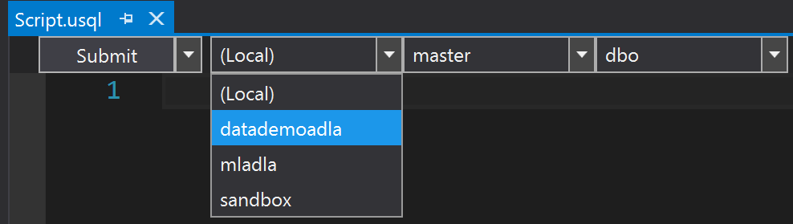

6.  Then click “Submit”. The job will then be submitted to the Azure
    data lake service to be executed. When it is completed a file with
    Key Phrases from the news stories will appear in the storage account
    we created at the root of the “processednewsfeed” container.

View Results in PowerBI
=======================

1.  If you do not already have a copy of PowerBI, download it here.

2.  Open Power BI and create a new report

3.  Click on “Get Data” -&gt; Azure -&gt; Microsoft Azure Blob Storage

    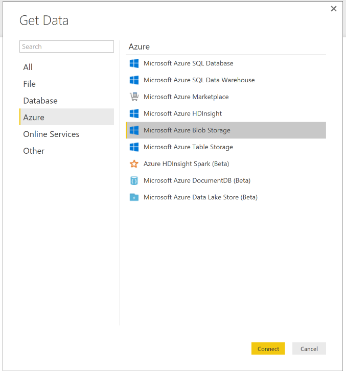

4.  Input your storage account name and the key (from “Access Keys” in
    the storage account blade)

    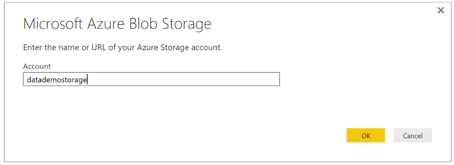

5.  Select “processednewsfeed” and click on “Edit”

    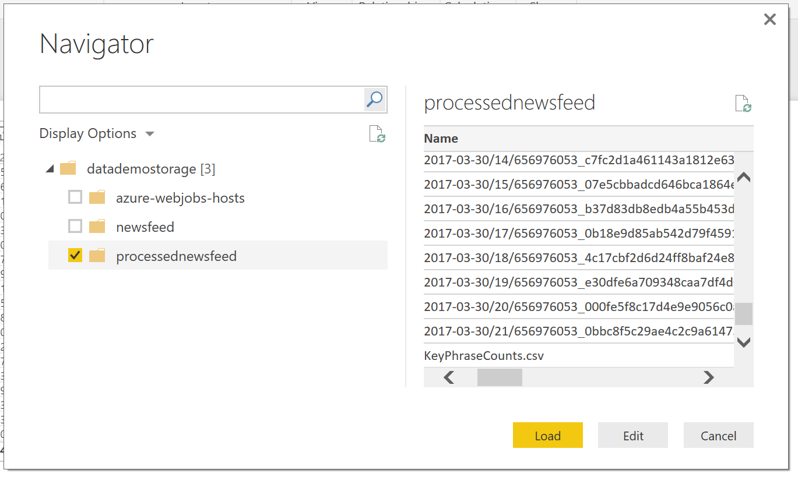

6.  Then scroll down to the processednewsfeed.csv file and click on
    “binary” in the left-most column to load the file’s contents.

7.  Click on “Column 2” -&gt; “Number Filters” -&gt; “Greater Than…” and
    enter a number that will allow you to keep the top 20-50 rows. Click
    “OK”

    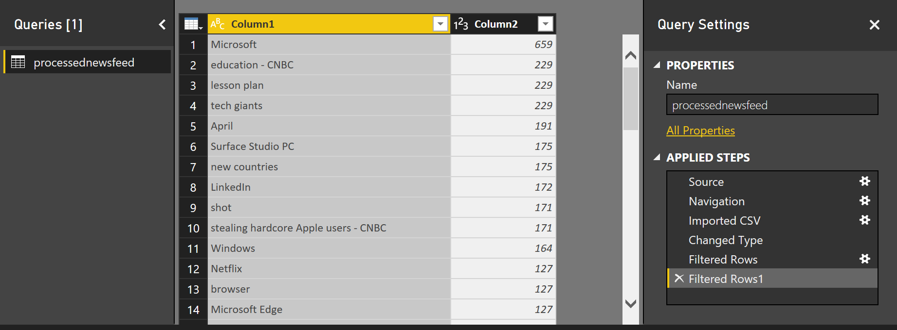

8.  Click “Close & Apply” at the top right of the Query Editor.

9.  Then in the PowerBI Editor select “Column 1” and “Column 2” in the
    right-most blade:

    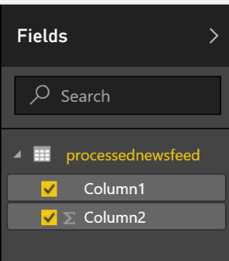

Something like this table should appear on the canvas to the left:

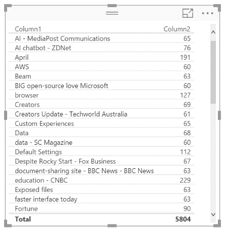

1.  Then in the “Visualizations” blade click the “Tree Map”
    () and you
    will see a nice graphic of the top key phrases that appeared in
    Google News today about Microsoft:

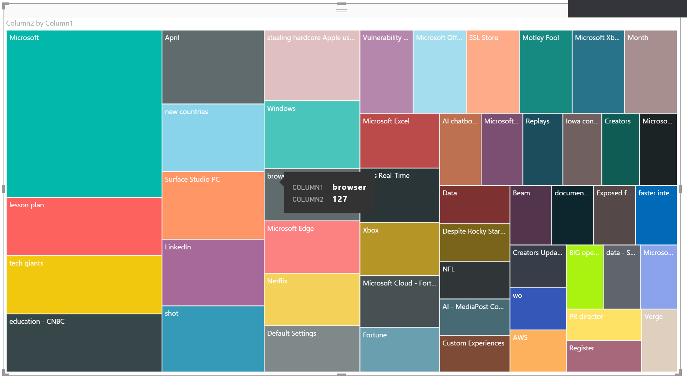

Voilà! Finally, when you are done, you can delete everything we’ve
created by simply deleting the resource group you created at the outset.
